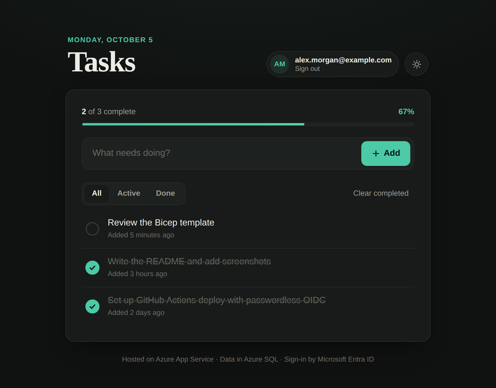
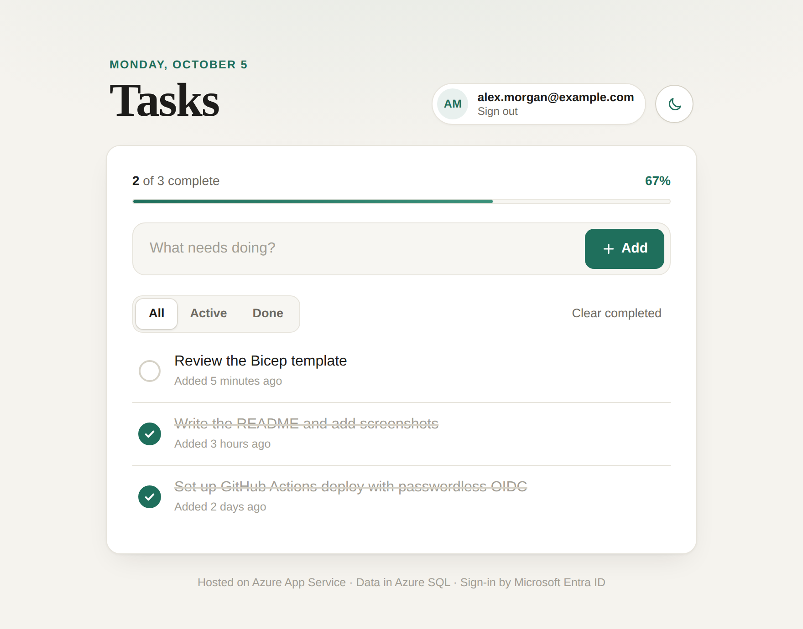
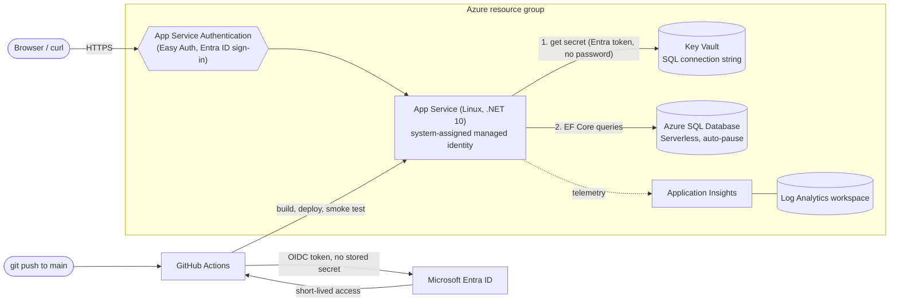

# Azure Task Tracker

A small task tracker built with **C# / ASP.NET Core 10** (REST API plus a plain HTML/CSS/JS web interface) and deployed to **Microsoft Azure**. The app itself is intentionally simple. The goal of the project is hands-on experience with the Azure services that most engineering teams rely on: compute, data, secrets and identity, observability, infrastructure as code, and CI/CD.

> Learning project: runs on free / low-cost tiers, not a production system.

<p align="center">
  
  
</p>

The deployed app sits behind **Microsoft Entra ID sign-in** (App Service Authentication), so it isn't open to the public. The screenshots above show the interface with sample data. The theme toggle is in the top right.

## Architecture



## What's in it

| Concern | Azure service | How it's used |
|---|---|---|
| Compute | **App Service** (Linux, F1 Free tier) | Hosts the ASP.NET Core API |
| Data | **Azure SQL Database** (Serverless, auto-pause) | Stores tasks; schema managed with EF Core migrations |
| Secrets | **Key Vault** (RBAC authorization) | Holds the SQL connection string; loaded at startup |
| Identity (app to vault) | **Managed identity** + **Microsoft Entra ID** | The web app reads Key Vault with no password in code or config |
| Identity (users to app) | **App Service Authentication** ("Easy Auth") | Users sign in with Microsoft before any request reaches the app |
| Observability | **Application Insights** + **Log Analytics** | Requests, dependencies, exceptions, and logs; queried with KQL |
| Infrastructure as Code | **Bicep** | `infra/main.bicep` describes all of the above |
| CI/CD | **GitHub Actions** with **OIDC** | Build and deploy on push to `main`, with no stored cloud credentials |

## API

Base path: `/api/tasks`

| Method | Path | Description |
|---|---|---|
| `GET` | `/api/tasks` | List all tasks |
| `GET` | `/api/tasks/{id}` | Get one task |
| `POST` | `/api/tasks` | Create a task |
| `PUT` | `/api/tasks/{id}` | Update a task |
| `DELETE` | `/api/tasks/{id}` | Delete a task |
| `GET` | `/api/me` | Name of the signed-in user (display only, read from the Easy Auth header) |
| `GET` | `/healthz` | Liveness check (used by the deploy smoke test; excluded from sign-in) |

Example:

```bash
curl -i -X POST "https://<your-app-hostname>/api/tasks" \
  -H "Content-Type: application/json" \
  -d '{"title":"buy milk"}'
```

Swagger UI is enabled only when running in the `Development` environment.

## Web interface

`wwwroot/` contains a dependency-free front end (no framework, no build step) served by the same app:

- **Add, rename (double-click), complete, and delete** tasks, with All / Active / Done filters and a progress bar.
- **Optimistic updates** with rollback if the API call fails.
- **Session handling:** if the App Service sign-in session expires, the page shows a "Sign in again" banner instead of failing silently.
- **Cold-start messaging:** the free tier sleeps when idle, so the page explains slow first loads.
- **Dark by default with a light/dark toggle**; the choice is remembered in the browser and applied before first paint, so there's no flash. Responsive down to phone width, keyboard accessible, reduced-motion aware.
- Task titles are written to the page with `textContent`, never `innerHTML`, so they can't inject markup.

Because the page and API share one origin, no CORS configuration is needed.

## Authentication

Sign-in is handled by **App Service Authentication ("Easy Auth")**, configured on the Web App rather than in application code:

1. **Web App, Authentication, Add identity provider, Microsoft.** Create a new app registration, choose **Current tenant: single tenant** (so only accounts in your own directory can sign in), set **Require authentication**, and choose **HTTP 302 redirect** for unauthenticated requests.
2. **Exclude the health probe** so the deploy smoke test can still reach it unauthenticated:

   ```bash
   az extension add --name authV2
   az webapp auth update --name <app> --resource-group rg-task-tracker --excluded-paths "/healthz"
   az webapp auth show --name <app> --resource-group rg-task-tracker --query globalValidation
   ```

   Check that the output shows `"/healthz"` exactly; some Azure CLI versions have been reported to truncate this value.

Easy Auth runs in the platform, in front of the app, so unauthenticated requests are rejected before they reach any C# code. The app only *displays* the user's name from the `X-MS-CLIENT-PRINCIPAL-NAME` header and never makes security decisions from it.

Known limits: authorization is all-or-nothing (everyone who can sign in sees every task; tasks aren't per-user), and the Portal-created app registration uses a client secret that expires and must be rotated. Per-user tasks would add a `UserId` column and an EF migration. Easy Auth settings are configured in the Portal and are not yet captured in Bicep.

## Project layout

```
.
├── Controllers/TasksController.cs   # the CRUD endpoints
├── Data/TaskDbContext.cs            # EF Core context
├── Models/TaskItem.cs               # entity
├── Migrations/                      # EF Core migrations
├── Program.cs                       # startup, Key Vault, DbContext, telemetry, static files
├── wwwroot/                         # web interface (index.html, style.css, app.js)
├── infra/
│   ├── main.bicep                   # all Azure resources
│   ├── main.parameters.json
│   ├── setup-github-oidc.sh         # one-time OIDC trust setup
│   └── README.md                    # Bicep deploy instructions
└── .github/workflows/deploy.yml     # CI/CD pipeline
```

## Run locally

Prerequisites: .NET 10 SDK, Azure CLI (`az login`), and a SQL Server / Azure SQL database you can reach.

```bash
# Store the connection string outside source control
dotnet user-secrets set "ConnectionStrings:TaskDb" "<your connection string>"

# Create / update the schema
dotnet ef database update

# Run
ASPNETCORE_ENVIRONMENT=Development dotnet run
```

Locally the app reads the connection string from user-secrets. In Azure, the `KeyVaultUri` app setting turns on Key Vault loading instead, and `DefaultAzureCredential` resolves to the managed identity.

## How secrets work

1. The app's only configuration is the Key Vault **address** (`KeyVaultUri`), which is not sensitive.
2. At startup it authenticates to Key Vault with its **system-assigned managed identity**, which holds the *Key Vault Secrets User* role.
3. It reads the secret `ConnectionStrings--TaskDb`. Key Vault names can't contain `:`, so `--` is used, and the .NET configuration provider maps it to `ConnectionStrings:TaskDb`.
4. Secrets are read **once at startup**, so after changing a secret, restart the app.

No password or key appears in the repository, app settings, or pipeline.

## CI/CD

`.github/workflows/deploy.yml` runs on every push to `main` (and manually via **Run workflow**):

1. **Build job:** restore, build, publish, upload the published output as an artifact.
2. **Deploy job:** download that exact artifact, sign in to Azure with **OIDC**, deploy with `azure/webapps-deploy`, then smoke-test `/healthz` with retries (checking the response body, so a sign-in redirect can't pass as success).

Authentication uses **workload identity federation**: an Entra app registration trusts tokens that GitHub issues for this repository's `main` branch, so the pipeline holds no password. The identity has the **Website Contributor** role scoped to the single web app (least privilege).

One-time setup (after the App Service exists):

```bash
chmod +x infra/setup-github-oidc.sh
./infra/setup-github-oidc.sh <github-owner>/<repo>
```

Then add the three values it prints as repository secrets: `AZURE_CLIENT_ID`, `AZURE_TENANT_ID`, `AZURE_SUBSCRIPTION_ID`. These identify the app; they are not credentials.

## Infrastructure as Code

The environment was first built by hand in the Azure Portal to learn each service, then described in Bicep. See [`infra/README.md`](infra/README.md) for deploy steps.

Status: the template compiles cleanly with the Bicep CLI. A from-scratch deployment into an empty resource group has not yet been run end to end. The template intentionally does not create the secret's value; set it after deployment. App Service Authentication is not yet part of the template.

## Cost notes

- App Service runs on the **F1 Free** plan, which is slow to wake after idling.
- Azure SQL is **Serverless** with auto-pause, so compute isn't billed while idle. The first request after a pause incurs a cold start of several seconds.
- Total spend so far is a few dollars of Azure credit. Setting a Cost Management budget alert is recommended.

## Lessons learned

- **Regional quotas:** new subscriptions can have zero App Service quota in some regions; deploying to a different region fixed it.
- **RBAC control plane vs data plane:** being *Owner* of a vault doesn't let you read its secrets; you need a data-plane role such as *Key Vault Secrets Officer*.
- **SQL networking:** "Deny public network access" blocks migrations from a laptop; firewall rules and the "Allow Azure services" option each solve a different part.
- **EF Core defaults:** letting EF create the database picked an expensive default tier instead of Serverless. Create the database through infrastructure code.
- **Startup-time secrets:** a corrected secret isn't used until the app restarts. A pasted placeholder in the connection string caused a 500, diagnosed with Application Insights.
- **Federated credentials match exactly:** newer GitHub repos include immutable numeric IDs in the OIDC subject claim, so the trust record must match that exact form.
- **Free-tier cold starts:** the deploy smoke test needs timeouts and retries.
- **Auth changes health checks:** once sign-in is required, an unauthenticated probe gets redirected; `curl -f` treats a 302 as success, so the smoke test now checks the response body.

## Clean up

Deleting the resource group removes everything and stops all charges:

```bash
az group delete --name rg-task-tracker --yes --no-wait
```

## Tech stack

C#, .NET 10, ASP.NET Core Web API, Entity Framework Core 10, Azure App Service, Azure SQL Database, Azure Key Vault, Microsoft Entra ID (managed identity), Application Insights, Log Analytics (KQL), Bicep, GitHub Actions (OIDC).
